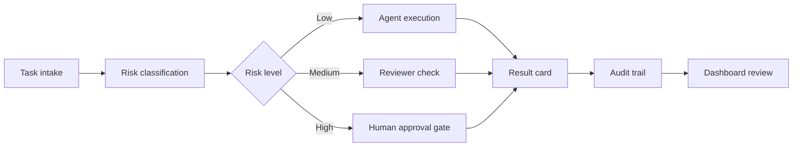

# Agent Governance Workbench

A lightweight AI agent governance workbench with handoff queues, approval gates, audit-ready result cards, and local decision dashboards.

Most agent frameworks help you build agents. This workbench helps you operate agent teams safely.


## Why this exists

AI teams are moving from single prompts to agent teams: researchers, builders, reviewers, operators, and human approvers. The hard part is no longer only "how do I create an agent?" It is also:

- Who owns the next action?
- Which tasks are safe to automate?
- Which tasks require human approval?
- Where is the evidence for a completed task?
- How do we avoid runaway cost, hidden state, and accidental secret exposure?

Agent Governance Workbench is a small, local-first template for that operating layer.

## What you get

- Handoff queues for scoped agent tasks
- Result cards for audit-ready outcomes
- Risk levels for low, medium, and high-risk work
- Human approval gates before irreversible actions
- A local Streamlit dashboard for status and review
- Privacy-first examples with synthetic data only
- Templates that can be adapted to any agent framework

## Quick start

```bash
git clone https://github.com/yohojj/agent-governance-workbench.git
cd agent-governance-workbench
python3 -m venv .venv
source .venv/bin/activate
pip install -r requirements.txt
streamlit run app.py
```

Then open the local URL printed by Streamlit.

## Dashboard preview

The demo dashboard includes:

- Agent roles and ownership
- Task queue status
- Approval gates
- Risk register
- Audit-ready result cards
- A governance workflow map

All bundled examples are fictional. Do not put real credentials, customer data, personal data, or private task histories in this repository.

## How it compares

| Category | Examples | Focus | This workbench adds |
| --- | --- | --- | --- |
| Agent frameworks | LangChain, AutoGen, CrewAI | Build and run agents | Operating rules, queues, approvals |
| Agent platforms | Dify, Flowise | Visual workflows and deployment | Lightweight local governance templates |
| Evals and observability | Langfuse, promptfoo, DeepEval | Measure and test behavior | Human approval and audit artifacts |
| Content/video tools | Remotion, Manim, ComfyUI | Create media or visual workflows | Governance around staged production |

## Core workflow



## Repository structure

```text
agent-governance-workbench/
  app.py                    # Local Streamlit dashboard
  examples/                 # Synthetic sample data
  templates/                # Handoff, result, approval, audit templates
  docs/                     # Governance model and launch notes
  scripts/                  # Generic local validation helpers
  README.md
  SECURITY.md
  LICENSE
```

## Design principles

1. Local first: the demo runs without external APIs.
2. Synthetic by default: examples are fictional and safe to publish.
3. Approval before impact: high-risk work stops at a gate.
4. Evidence over memory: completed work should point to verifiable artifacts.
5. Small templates over heavy platforms: use this as an operating layer, not a replacement for your agent stack.

## Roadmap

- Export dashboard snapshots to static HTML
- Add optional GitHub Issues integration
- Add a stricter privacy scanner profile
- Add Docker support
- Add example governance packs for research, coding, and content production teams

## License

MIT License. See [LICENSE](LICENSE).
