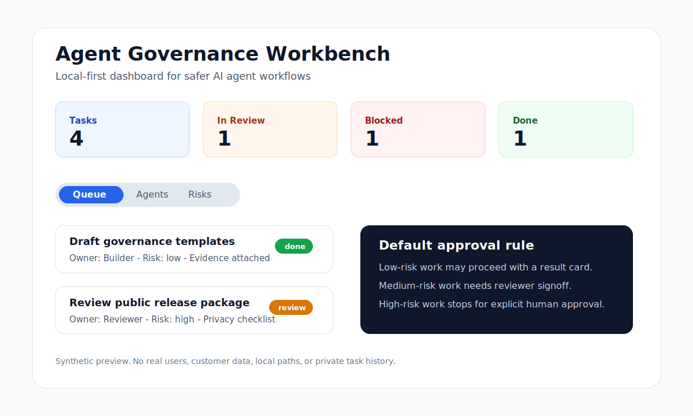

# Agent Governance Workbench 中文说明

这是一个面向更安全 AI Agent 工作流的本地优先看板与模板包。

它不是新的 Agent 框架，而是帮助你运行 Agent 工作流：谁负责、边界在哪里、风险多高、是否需要人工审批、结果证据在哪里、是否可以继续推进。

## 看板预览



预览图只使用仓库内的虚构数据。如果后续替换成 GIF，请保持同样边界：不展示浏览器地址栏、本地路径、真实人物、私有任务历史、客户数据或生产数据。

## 为什么需要它

AI 工作正在从单次提示变成多 Agent 协作：研究者、构建者、审查者、操作者和人工审批者会共同推进任务。难点不只是“如何创建 Agent”，还包括谁负责下一步、哪些动作需要审批、完成结果有哪些证据、怎样避免密钥和隐私泄露。

核心能力：

- 任务交接队列
- 风险分级
- 人工审批门禁
- 可审计结果卡
- 本地 Streamlit 看板
- 全部示例数据均为虚构数据

三种用法：

- 运行本地看板：查看虚构任务队列、Agent 角色、风险登记表、工作流和审批门禁。
- 复制模板：把任务交接卡、结果卡、审批门禁和审计清单放进你自己的 Agent 工作流。
- 发布前使用清单：在公开发布、外部写入或高风险操作前检查密钥、私有路径、证据缺口和审批状态。

3 分钟试用：

```bash
git clone https://github.com/yohojj/agent-governance-workbench.git
cd agent-governance-workbench
python3 -m venv .venv
source .venv/bin/activate
pip install -r requirements.txt
streamlit run app.py
```

然后打开 Streamlit 打印出的本地 URL，查看虚构任务队列、风险登记表、审批门禁和结果卡流程。

适合人群：

- 想在 Agent 工作变复杂前建立轻量运行规则的 solo builders。
- 需要协调构建者、审查者、操作者和人工审批者的小团队。
- 需要任务队列、风险等级、审批门禁和证据链的 Agent workflow operators。
- 想给内容、研究或代码工作流补上治理模板的负责人。

它不是什么：

- 不是新的 Agent 框架。
- 不是托管平台。
- 不是生产级安全产品。
- 不是存放真实密钥、客户数据、个人数据、私有任务历史或生产日志的地方。

这个公开仓库不包含任何真实个人数据、密钥、内部任务历史或私有路径。
